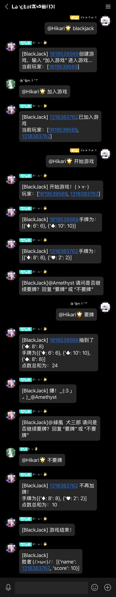

# BlackJack

一个面向LangBot的BlackJack（21点）游戏插件！

## 安装

配置完成 [LangBot](https://github.com/RockChinQ/LangBot) 主程序后使用管理员账号向机器人发送命令即可安装：

```
!plugin get https://github.com/AmethystTim/BlackJack.git
```
或查看详细的[插件安装说明](https://docs.langbot.app/plugin/plugin-intro.html#%E6%8F%92%E4%BB%B6%E7%94%A8%E6%B3%95)

## 使用

### 演示

<details>

<summary>展开查看</summary>



</details>

### 指令

- blackjack/21点: 创建游戏
- 加入游戏: 加入游戏
- 结束游戏: 结束游戏
- 要牌/不要牌：决定是否要继续抽牌